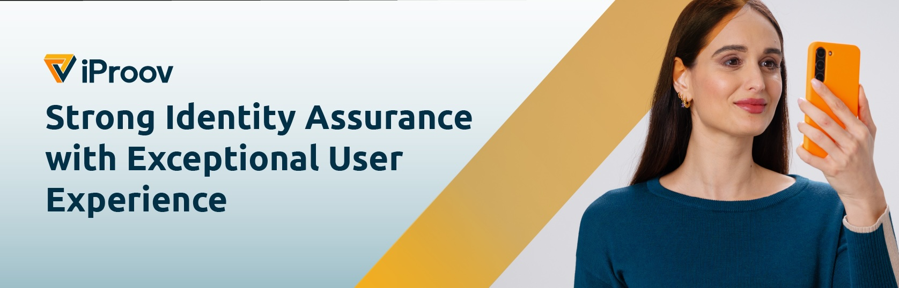

# iProov Biometrics .NET MAUI SDK

## Table of contents

- [Introduction](#introduction)
- [Requirements](#requirements)
- [Repository contents](#repository-contents)
- [Registration](#registration)
- [Installation](#installation)
- [Get Started](#get-started)
- [Options](#options)
- [Handling Errors](#handling-errors)
- [API Client](#api-client)
- [Sample code](#sample-code)

## Introduction

The iProov .NET MAUI SDK enables you to integrate iProov into your .NET Android / iOS / MAUI projects. The iProov's native SDK for [iOS](https://github.com/iProov/ios) (Swift) and [Android](https://github.com/iProov/android) (Java / Kotlin) are wrapped behind a .NET interface for their use within .NET apps. Given the differences in the implementation between these .NET interfaces, the iProov.NET.MAUI wraps both interfaces into a unified .NET version of the iProov API to ease the integration of the iProov Biometric SDKs in MAUI developments. 

We also provide a .NET API Client written in C# to call our [REST API v2](https://eu.rp.secure.iproov.me/docs.html) from a .NET Standard Library, which can be used from your .NET app to request tokens directly from the iProov API (note that this is not a secure way of getting tokens, and should only be used for demo/debugging purposes).

This documentation is focused on the **iProov.NET.MAUI** package. There's also documentation available for [iProov.NET.Android](https://github.com/iProov/dotnet-maui/tree/master/Documentation/iProov.NET.Android/) and [iProov.NET.iOS](https://github.com/iProov/dotnet-maui/tree/master/Documentation/iProov.NET.iOS/) packages.

## Requirements

- NET 8 (net8-android & net8-ios)
- iOS 13 and above
- Android API Level 26 (Android 8 Oreo) and above

## Repository contents

The iProov .NET MAUI SDK is provided via this repository, which contains the following:

- **README.md** - This document
- **NuGet Packages** - Folder containing the NuGet packages for iProov.NET.Android, iProov.NET.iOS & iProov.NET.MAUI
- **APIClient** - C# project with the source code for the .NET API Client
- **ExampleAppMAUI** - Sample code demonstrating use of the iProov.NET.MAUI together with the .NET API Client

## Registration

You can obtain API credentials by registering on the [iProov Partner Portal](https://www.iproov.net).

## Installation

The **iProov.NET.MAUI** library is available at [nugets.org](https://www.nuget.org/packages/iProov.NET.MAUI/). Hence, you can add the package to your project either:

1. Using the NuGet Package Manager, and adding the iProov.NET.MAUI package to your project from there. For further instructions on how to install and manage packages, [see here](https://learn.microsoft.com/en-us/nuget/consume-packages/install-use-packages-visual-studio).

> If you want to use the nuget package from a local source, make sure to add the folder where you store the nuget packages as a Nuget source in Visual Studio > Preferences

2. Or edit your `.csproj` file and add the `<PackageReference>` to the `iProov.NET.MAUI` package

 ```
 <ItemGroup>
   <PackageReference Include="iProov.NET.MAUI" Version="2.0.2" />
 </ItemGroup>
 ```

## Get Started

### Get a Token

There are two types of tokens:

- A **verify** token for logging in an existing user
- An **enrol** token for registering a new user

See the [REST API documentation](https://secure.iproov.me/docs.html) for details about how to generate tokens.

> **TIP:** In a production app you typically obtain tokens via a server-to-server back-end call. For demos and testing, iProov provides .NET sample code for obtaining tokens via [iProov API v2](https://eu.rp.secure.iproov.me/docs.html) with our open-source [API Client](https://github.com/iProov/dotnet-maui/tree/master/APIClient).


### Launch the SDK

#### 1. Create an instance of IProovWrapper

 ```csharp
	private IProovWrapper wrapper = new IProovWrapper();
 ```

#### 2. Listening to IProovStates

To monitor the progress of an iProov claim and receive the result you need an instance of `IProovWrapper.IStateListener` interface. So, you will have to implement this interface in one of your classes, or create a new one, as shown in the following example.

 ```csharp
public class IProovListener: IProovWrapper.IStateListener {

	public void OnConnecting()
	{
		// Called when the SDK is connecting to the server. You could provide an indeterminate
		// progress indication to let the user know that the connection is being established.
	}

	public void OnConnected()
	{
		// The SDK has connected and the iProov user interface is now displayed. You
		// could hide any progress indicator at this point.
	}

	public void OnProcessing(double progress, string? message)
	{
		// The SDK updates your app with the streaming progress to the server and the user authentication.
		// Called multiple times as the progress updates. You could update a determinate progress indicator.
	}

	public void OnCanceled(Canceler canceler)
	{
		// The user canceled iProov, either by pressing the close button at the top of the screen, or sending
		// the app to the background. (canceler == Canceler.User)
In		// Or, the app canceled (event.canceler == Canceler.Integration) by canceling the claim.
		// You should use this to determine the next step in your flow.
	}

	public void OnError(IProovException exception)
	{
		// The user was not successfully verified/enrolled due to an error (e.g. lost internet connection).
		// You will be provided with an Exception (see below).
		// It will be called once, or never.
		// An IProovException contains a title that describes the exception, and may also contain a message.
		string title = exception.title;
		string? message = exception.message;
	}

	public void OnFailure(IProovFailureResult failure)
	{
		// The user was not successfully verified/enrolled as their identity could not be verified.
		// Or there was another issue with their verification/enrollment.
		// You might provide feedback to the user as to how to retry. 
		// A FailureReason value is provided to identify the reason as to why the claim failed. Some reasons also provide an optional description (as a string).
		// When enabled for your service provider, failure.frame contains the bytes of an image containing a single frame of the user

		FailureReason reason = failure.reason;
		string? description = failure.description;
		byte[]? frame = failure.frame;
	}

	public void OnSuccess(byte[]? frame)
	{
		// The user was successfully verified/enrolled.
		// You must always independently validate the token server-side (using the /validate API call) before performing any authenticated user actions.
		// When enabled for your service provider, frame contains the bytes of an image containing a single frame of the user
	}
}
 ```

#### 3. Launch a Claim

To launch a claim you need to provide a `token`, the websocket url of the service provider you are using and an `IStateListener` instance. Additionally you can provide an instance of `IProovOptions` (see [below](#options)) to customize the user experience.

 ```csharp
	IProovWrapper wrapper = new IProovWrapper();
	IProovListener listener = new IProovListener();

	private void launchIProov(string token, string userId)
	{
		var options = new IProovOptions();
		// Here you can customize any IProovOption

		wrapper.LaunchIProov(token, "wss://eu.rp.secure.iproov.me/ws", listener, options);
    }
 ```

#### _\** Running on iOS_

For iProov to work on iOS devices, you need to add a `Privacy - Camera Usage Description` entry to your Info.plist file (`<Your_App_Folder>/Platforms/iOS/Info.plist`) with the reason why your app requires camera access (e.g. "To iProov you in order to verify your identity.")

### Canceling a claim

Under normal circumstances, the user will be in control of the completion of the claim, i.e. they will either complete the claim, or use the close button to cancel. In some cases, you (the integrator) may wish to cancel the iProov claim programmatically, for example in response to a timeout or change of conditions in your app.

To cancel an ongoing claim, you first need to hold a reference to the `IProovWrapper` object and you can then call `Cancel()` on it.

```csharp
IProovWrapper wrapper = new IProovWrapper();
IProovListener listener = new IProovListener();
var options = new IProovOptions();

wrapper.LaunchIProov(token, "wss://eu.rp.secure.iproov.me/ws", listener, options);

// Example - cancel the wrapper session after 10 sec
System.Timers.Timer timer = new System.Timers.Timer(10000);
timer.Elapsed += (sender, e) => 
{
    wrapper.Cancel(); // Will return true if the wrapper session was successfully canceled
};
timer.Enabled = true;
```

## Options

The `Options` class allows iProov to be customized in various ways. These can be specified by passing an instance of `IProovOptions` in the `LaunchIProov()` method.

Most of these options are common to both Android and iOS, however, there are some options that are platform-specific.

For full documentation, please read the respective [iOS](https://github.com/iProov/ios#options) and [Android](https://github.com/iProov/android#customize-the-user-experience) native SDK documentation.

A summary of the support for the various SDK options in **iProov.NET.MAUI** is provided below. All options are nullable and any options not set will default to their platform-defined default value.

| Option | Type | iOS | Android |
|---|---|---|---|
| `filter` | `Filter?` [(See filter options)](#filter-options)| ✅ | ✅ |
| `titleTextColor` | `Color?` | ✅ | ✅ |
| `promptTextColor` | `Color?` | ✅ | ✅ |
| `closeButtonTintColor` | `Color?` | ✅ | ✅ |
| `closeButtonImage` | `byte[]?` | ✅ | ✅ |
| `title` | `string?` | ✅ | ✅ |
| `fontPath` | `string?` | ✅  | ✅ |
| `logoImage` | `byte[]?` | ✅ | ✅ |
| `promptBackgroundColor` | `Color?` | ✅ | ✅ |
| `promptRoundedCorners` | `bool?` | ✅ | ✅ |
| `surroundColor` | `Color?` | ✅ | ✅ |
| `certificates` | `IList<string>?` | ✅ | ✅ |
| `timeout` | `int?` | ✅ | ✅ |
| `enableScreenshots` | `bool?` |  | ✅ |
| `orientation` | `Orientation?` |  | ✅ |
| `camera` | `Camera?` |  | ✅ |
| `headerBackgroundColor` | `Color?` | ✅ | ✅ |
| `disableExteriorEffects` | `bool?` | ✅ | ✅ |
| `stringsTable` | `string?` | ✅ | |
| `stringsBundle` | `string?` | ✅ | |
|**`genuinePresenceAssurance`** | `GenuinePresenceAssurance?` |  |  |
| ↳ `readyOvalStrokeColor` | `Color?` | ✅ | ✅ |
| ↳ `notReadyOvalStrokeColor` | `Color?` | ✅ | ✅ |
|**`livenessAssurance`** | `LivenessAssurance?` |  |  |
| ↳ `ovalStrokeColor` | `Color?` | ✅ | ✅ |
| ↳ `completedOvalStrokeColor` | `Color?` | ✅ | ✅ |

### Filter Options

The SDK supports two different camera filters:

#### `LineDrawingFilter`

`LineDrawingFilter` is iProov's traditional "canny" filter, which is available in 3 styles: `.Shaded` (default), `.Classic` and `.Vibrant`.

The `foregroundColor` and `backgroundColor` can also be customized.

Example:

```csharp
var options = IProovOptions();

options.filter = new IProovOptions.LineDrawingFilter(
                style: LineDrawingFilterStyle.Shaded,
                foregroundColor: Colors.Black,
                backgroundColor: Colors.White);
```

#### `NaturalFilter`

`NaturalFilter` provides a more direct visualization of the user's face and is available in 2 styles: `.Clear` (default) and `.Blur`.

Example:

```csharp
var options = IProovOptions();

options.filter = new IProovOptions.NaturalFilter(style: NaturalFilterStyle.Clear);
```

> **Note**: `NaturalFilter` is available for Liveness Assurance claims only. Attempts to use `NaturalFilter` for Genuine Presence Assurance claims will result in an error.

## Handling errors

All errors from the native SDKs are re-mapped to `IProovException` exceptions:

| Exception                         | iOS | Android | Description                                                                                                                      |
| --------------------------------- | --- | ------- | -------------------------------------------------------------------------------------------------------------------------------- |
| `CaptureAlreadyActiveException`   | ✅   | ✅       | An existing iProov capture is already in progress. Wait until the current capture completes before starting a new one.           |
| `NetworkException`                    | ✅   | ✅       | An error occurred with the video streaming process. Consult the `message` value for more information.                            |
| `CameraPermissionException`           | ✅   | ✅       | The user disallowed access to the camera when prompted. You should direct the user to re-enable camera access.                   |
| `ServerException`                 | ✅   | ✅       | A server-side error/token invalidation occurred. The associated `message` will contain further information about the error.      |
| `UnexpectedErrorException`        | ✅   | ✅       | An unexpected and unrecoverable error has occurred. These errors should be reported to iProov for further investigation.         |
| `UnsupportedDeviceException`         |✅   | ✅         | Device is not supported.|
| `ListenerNotRegisteredException`  |     | ✅       | The SDK was launched before a listener was registered.                                                                           |
| `MultiWindowUnsupportedException` |     | ✅       | The user attempted to iProov in split-screen/multi-screen mode, which is not supported.                                          |
| `CameraException`                 |     | ✅       | An error occurred acquiring or using the camera. This could happen when a non-phone is used with/without an external/USB camera. |
| `FaceDetectorException`           |     | ✅       | An error occurred with the face detector.                                                                                        |
| `InvalidOptionsException`         |     | ✅       | An error occurred when trying to apply your options.|
| `UserTimeoutException`         |✅   |          | The user has taken too long to complete the claim.|


## API Client

The .NET API client provides a convenient wrapper to call iProov's REST API v2 from a .NET Standard Library. It is a useful tool to assist with testing, debugging and demos, but should not be used in production mobile apps. You could also adapt this code to run on your back-end to perform server-to-server calls.

> ⚠️ **SECURITY NOTICE:** Use of the .NET API Client requires providing it with your API secret. **You should never embed your API secret within a production app.**

### Functionality

The .NET API Client supports the following functionality:

- `GetToken()` - Get an enrol/verify token
- `EnrolPhoto()` - Perform a photo enrolment (either from an electronic or optical image). The image must be provided in JPEG format.
- `Validate()` - Validate an existing token against the provided User ID.
- `EnrolPhotoAndGetVerifyToken()` - A convenience method which first gets an enrolment token, then enrols the photo against that token, and then gets a verify token for the user to iProov against.

### Installation

To add the .NET API Client to your project, add it as a sub-project to your solution, and then [add a reference](https://docs.microsoft.com/en-us/visualstudio/mac/managing-references-in-a-project?view=vsmac-2019) to the **APIClient** project from your app project.

You can now import the API Client with `using iProov.APIClient;`.

### Usage examples

We will now run through a couple of common use-cases with the API Client. All the API Client source code is provided, so you can understand how it works and adapt it accordingly.

#### Getting a token

The most basic thing you can do with the API Client is get a token to either enrol or verify a user, using either iProov's Genuine Presence Assurance or Liveness Assurance.

This is achieved as follows:

```csharp
ApiClient apiClient = new ApiClient(
            "https://beta.rp.secure.iproov.me/api/v2",
            "{{ apiKey }}",
            "{{ secret }}",
            "com.iproov.ExampleAppMAUI");

var token = await apiClient.GetToken(AssuranceType.GenuinePresence, ClaimType.Enrol, "{{ user id }}");
```

You can then launch the iProov SDK with this token.

## Sample code

For a simple iProov experience that is ready to run out-of-the-box, check out the [ExampleAppMAUI project](https://github.com/iProov/dotnet-maui/tree/master/ExampleAppMAUI) for a .NET MAUI app that uses `iProov.NET.MAUI` and also makes use of the .NET API Client.

### Usage

1. Rename `Credentials.example.cs` to `Credentials.cs` and update with your Base URL, API Key and Secret. You can obtain these credentials from [iProov Portal](https://portal.iproov.com/)
2. Open the ExampleAppMAUI solution in Visual Studio / VS Code.
3. Restore NuGet Packages to ensure all NuGet packages are ready for usage.
4. Run the ExampleAppMAUI project on a supported iOS or Android device.

> NOTE: iProov is not supported on the iOS or Android simulator, you must use a physical device in order to iProov.